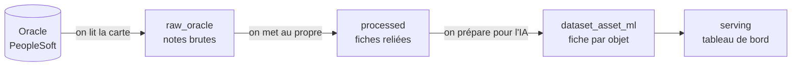

# A — Connexion & Préparation des données : Fiche Métier

> **Statut :** ✅ Complet · **Public cible :** Chef de projet, jury PFE, non-technicien

---

## Vision globale : que fait cette partie ?

La partie A est la **fondation de tout le projet**. Son rôle est de transformer une base ERP gigantesque et illisible en une **carte exploitable du patrimoine de données**.

Image simple : Oracle PeopleSoft, c'est une bibliothèque de **plus de 26 000 « livres » (tables)** et **87 000 « fiches » (objets logiques)**, sans catalogue. La partie A construit ce **catalogue complet et automatique** : quels objets existent, de quoi ils sont faits, quelle taille ils font, comment ils sont reliés. C'est ce catalogue qui permet ensuite de classer (B), modéliser (C), archiver (D) et chiffrer la valeur (E).

---

## Pourquoi c'est indispensable ?

Sans cette étape, le projet serait impossible :
- Personne ne peut analyser manuellement 26 000 tables.
- On ne sait pas lesquelles sont volumineuses, actives, ou liées entre elles.
- Aucune décision d'archivage fiable ne peut être prise.

La partie A automatise entièrement cette **cartographie**, sans jamais toucher aux données métier réelles (on ne lit que les *métadonnées* : descriptions, structures, volumes — pas le contenu des factures ou fiches RH).

---

## Comment ça marche, de bout en bout ?

Le système fonctionne en **trois temps**, comme une chaîne de préparation :

```
1. EXTRAIRE          2. STOCKER              3. PRÉPARER
Oracle PeopleSoft → base PostgreSQL    → jeu de données prêt
(on lit la carte)   (on range la carte)   pour le Machine Learning
```

### Temps 1 — Extraire (lire la carte)
Le système se connecte à Oracle **en lecture seule** et récupère, pour chaque objet :
- son nom et sa description,
- ses colonnes et leurs types,
- sa taille (nombre de lignes, espace disque),
- sa date de dernière utilisation,
- ses liens hiérarchiques (qui dépend de qui).

### Temps 2 — Stocker (ranger la carte)
Toutes ces informations sont copiées dans une **base PostgreSQL locale**, organisée en couches successives, du plus brut au plus raffiné :

| Couche | Rôle | Analogie |
|---|---|---|
| **admin** | Journal des exécutions | Le registre de qui a fait quoi, quand |
| **raw_oracle** | Copie fidèle des métadonnées Oracle | Les notes brutes prises sur le terrain |
| **processed** | Données nettoyées et organisées | Les fiches mises au propre et reliées |
| **serving** | Résultats finaux (scores, KPI) | Le tableau de bord pour décider |

**Illustration — le parcours de la donnée à travers les couches :**



*(Ce diagramme se rend visuellement dans l'aperçu Markdown de VS Code ou sur GitHub.)*

### Temps 3 — Préparer (rendre exploitable)
Les données brutes sont consolidées en **une fiche unique par objet**, contenant tout ce dont l'intelligence artificielle a besoin pour le classer : nom, colonnes, types, volumes, indices sémantiques. C'est le livrable de la partie A.

---

## Les deux niveaux d'Oracle PeopleSoft (concept clé)

PeopleSoft superpose deux niveaux qu'il faut distinguer :

| Niveau | C'est quoi | Exemple |
|---|---|---|
| **Logique** (record) | L'objet métier tel que l'application le voit | « VOUCHER » = une facture fournisseur |
| **Physique** (table) | La table Oracle réelle qui stocke les données | « PS_VOUCHER » sur le disque |

C'est pourquoi 87 000 objets logiques ne donnent que 26 000 tables physiques : beaucoup d'objets logiques sont des vues ou des structures réutilisables sans stockage propre. Le système gère les deux et les unifie dans un **catalogue commun** de 167 263 actifs.

---

## Ce que le système capture d'important

| Information | Pourquoi elle compte |
|---|---|
| **Volumes** (taille, nb de lignes) | Savoir quoi archiver en priorité (les grosses tables) |
| **Date de dernière analyse** | Repérer les données dormantes (non touchées depuis des années) |
| **Hiérarchie parent/enfant** (4 590 liens) | Ne pas casser un objet central en archivant ses dépendants |
| **Clés et index** | Découvrir les relations entre domaines métier |
| **Types et sémantique des colonnes** | Permettre la classification automatique et détecter les données sensibles (RGPD) |

---

## Garanties de fiabilité

Le pipeline est conçu pour être **rejouable et auditable** :
- Chaque exécution porte un **numéro (`run_id`)** → on peut comparer dans le temps (ex. croissance des données d'une année sur l'autre).
- Rejouer une extraction **n'crée jamais de doublon** (le système efface puis réinsère).
- Une **empreinte unique** par ligne permet de détecter ce qui a changé entre deux exécutions.
- Un **journal d'exécution** trace tout (succès, échecs, durées).

---

## Ce que la partie A apporte au projet

| Avant | Après la partie A |
|---|---|
| Base Oracle opaque, 26 000 tables | Catalogue complet de 167 263 actifs |
| Aucune visibilité sur les volumes | On sait quelle table pèse combien |
| Relations inconnues | 4 590 liens hiérarchiques cartographiés |
| Données non exploitables par l'IA | Jeu de données prêt pour le Machine Learning |

C'est la **brique sur laquelle reposent toutes les autres parties** du PFE.

---

## Limites connues

- **Accès Oracle via VPN** : la source est sur le réseau interne de l'entreprise.
- **Photo à un instant T** : chaque extraction est un instantané ; les volumes évoluent à chaque run.
- **MongoDB hors scope** : les collections MongoDB (termes métier, historiques de purge) sont prévues dans l'architecture mais pas encore connectées dans cette phase.
