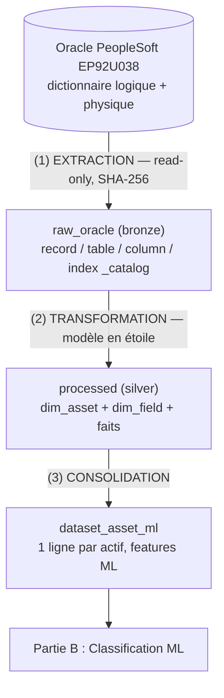
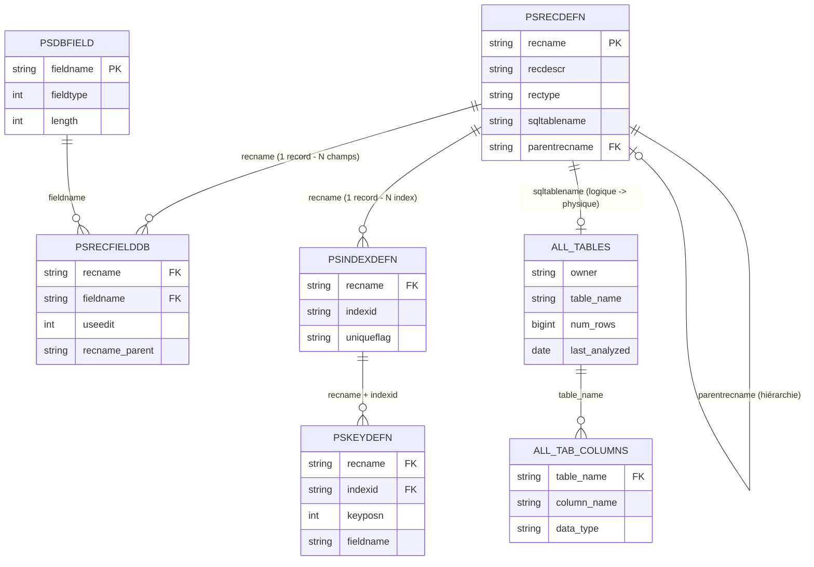
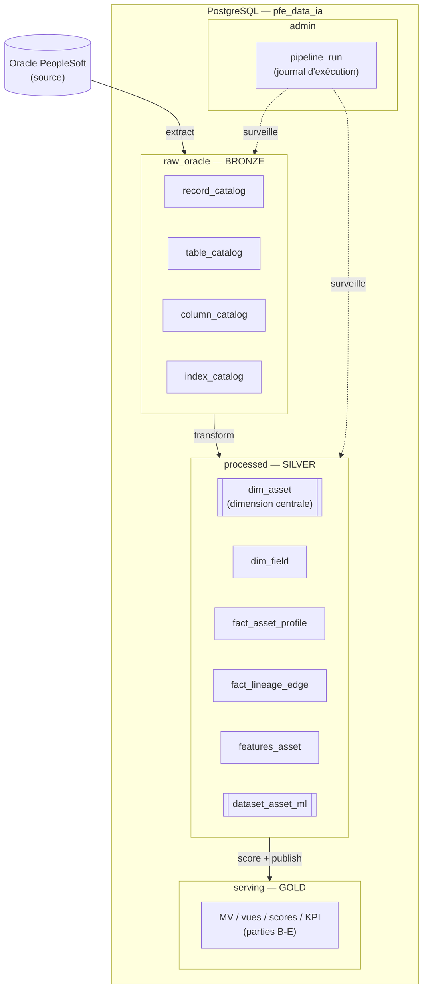
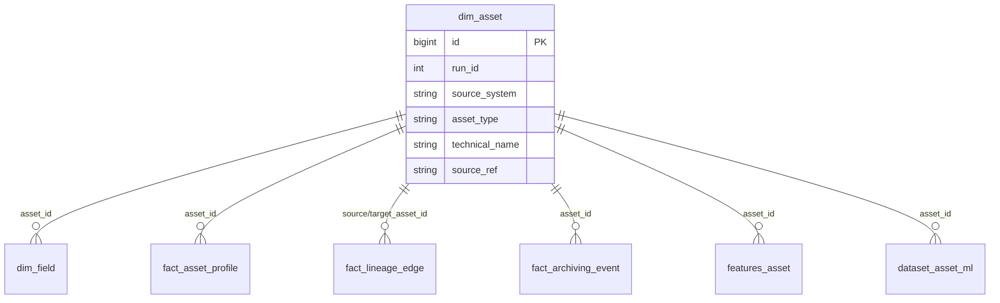

# A — Connexion & Préparation des données : Fiche Technique

> **Statut :** ✅ Complet · **Run de référence :** run_id = 5

---

## 1. Objectif et périmètre de la partie A

La partie A constitue **les fondations du pipeline de gouvernance**. Son rôle : transformer une base ERP opaque (Oracle PeopleSoft, ~26 000 tables physiques, ~87 000 objets logiques) en un **jeu de données structuré, traçable et exploitable** par les couches ML (B), modélisation (C), archivage (D) et KPI (E).

Concrètement, cette partie répond à trois questions :
1. **Que contient la base Oracle ?** → extraction exhaustive des métadonnées (catalogue des objets, colonnes, volumes, index, hiérarchie).
2. **Où stocker ces informations de façon réutilisable ?** → une base PostgreSQL organisée en couches.
3. **Comment préparer un jeu de données prêt pour le ML ?** → une chaîne de transformation qui consolide tout en un enregistrement par actif.

Le périmètre couvre : **connexion → extraction → chargement → couche brute → couche transformée → jeu de données ML**. Les sources MongoDB existent dans l'architecture mais sont hors scope de cette phase.

---

## 2. Vision d'ensemble du flux de données (bout en bout)

```
┌───────────────────────────┐
│  ORACLE PeopleSoft EP92U038│  Base source (lecture seule)
│  Dictionnaire PeopleSoft + │
│  dictionnaire Oracle       │
└─────────────┬─────────────┘
              │  (1) EXTRACTION  — src/extract/oracle/* (4 extracteurs, requêtes SQL read-only)
              │      oracledb thin mode, hash SHA-256 par ligne
              ▼
┌───────────────────────────┐
│  Couche RAW_ORACLE (PG)    │  Copie fidèle des métadonnées
│  record / table /          │  Clé : run_id + row_hash + loaded_at
│  column / index _catalog   │
└─────────────┬─────────────┘
              │  (2) TRANSFORMATION — src/transform/build_* (modèle dimensionnel)
              ▼
┌───────────────────────────┐
│  Couche PROCESSED (PG)     │  Modèle en étoile (star schema)
│  dim_asset, dim_field,     │  1 actif = 1 ligne dans dim_asset
│  fact_asset_profile,       │  faits rattachés par asset_id
│  fact_lineage_edge, ...    │
└─────────────┬─────────────┘
              │  (3) CONSOLIDATION — build_dataset_asset_ml
              ▼
┌───────────────────────────┐
│  processed.dataset_asset_ml│  1 ligne / actif, features prêtes ML
│  (features techniques +    │  → consommé par la partie B
│   sémantiques)             │
└───────────────────────────┘
```

**Illustration (diagramme Mermaid) :**



Chaque exécution complète est pilotée par **Prefect** (`flow_full_pipeline`) et tracée dans `admin.pipeline_run`.

> Les diagrammes Mermaid de ce document se rendent visuellement dans l'aperçu Markdown de VS Code, sur GitHub/GitLab, et la plupart des visionneuses Markdown récentes.

---

## 3. Architecture de la base SOURCE — Oracle PeopleSoft EP92U038

### 3.1 Nature de la source

PeopleSoft est un ERP qui superpose **deux niveaux** :
- un **niveau logique** : les *records* PeopleSoft (objets métier définis dans le dictionnaire applicatif) ;
- un **niveau physique** : les *tables Oracle* réelles qui stockent les données (`PS_<RECNAME>`).

Un record logique peut correspondre à une table physique, à une vue, ou à aucune table (sous-records, records de travail). Cette distinction est centrale pour comprendre pourquoi ~87 000 records logiques ne donnent que ~26 000 tables physiques.

### 3.2 Tables système exploitées

| Table source | Type | Rôle | Colonnes clés extraites |
|---|---|---|---|
| `SYSADM.PSRECDEFN` | Dictionnaire PeopleSoft | Définition des records logiques | `recname`, `recdescr`, `rectype`, `sqltablename`, **`parentrecname`** |
| `SYSADM.PSRECFIELDDB` | Dictionnaire PeopleSoft | Champs rattachés à chaque record | `recname`, `fieldname`, `fieldnum`, **`useedit`**, **`recname_parent`** |
| `SYSADM.PSDBFIELD` | Dictionnaire PeopleSoft | Définition globale des champs | `fieldtype`, `length`, `decimalpos`, `descrlong` |
| `SYSADM.PSINDEXDEFN` | Dictionnaire PeopleSoft | Définition des index | `recname`, `indexid`, `uniqueflag` |
| `SYSADM.PSKEYDEFN` | Dictionnaire PeopleSoft | Champs composant chaque index | `keyposn`, `fieldname`, `ascdesc` |
| `ALL_TABLES` | Dictionnaire Oracle | Statistiques physiques des tables | `num_rows`, `blocks`, `avg_row_len`, `last_analyzed`, `tablespace_name` |
| `ALL_TAB_COLUMNS` | Dictionnaire Oracle | Types physiques des colonnes | `data_type`, `data_length`, `nullable`, `num_distinct`, `num_nulls` |

### 3.3 Relations entre les objets source

```
PSRECDEFN (record logique)
   │ 1
   │ recname
   ├──────────────< PSRECFIELDDB (champs du record)  >────── PSDBFIELD (def. champ)
   │                        recname / fieldname              fieldname
   │
   ├──────────────< PSINDEXDEFN (index) >──────< PSKEYDEFN (champs d'index)
   │                  recname / indexid           recname / indexid / keyposn
   │
   │ parentrecname (auto-référence : hiérarchie record → record)
   └──────────────> PSRECDEFN (record parent)

PSRECDEFN.sqltablename  ─────► ALL_TABLES / ALL_TAB_COLUMNS (niveau physique Oracle)
```

**Illustration — modèle relationnel de la source Oracle (diagramme Mermaid) :**



Deux signaux structurels majeurs sont capturés :
- **`parentrecname`** (PSRECDEFN) : hiérarchie parent→enfant entre records (4 590 liens sur run_id=5). Base du lignage (partie C/D).
- **`indexid = '0'`** (PSINDEXDEFN) : index primaire → identifie les **clés primaires** et les **bridge keys** partagées entre records.
- **`useedit`** (bitmap PSRECFIELDDB) : encode le type de clé (bit 0 = KEY, bit 2 = SEARCH_KEY).
- **`recname_parent`** (PSRECFIELDDB) : rattachement d'un champ à un sous-record réutilisable (77 784 liens).

### 3.4 Requêtes d'extraction (read-only)

| Extracteur | Source SQL | Sortie |
|---|---|---|
| `extract_record_catalog` | `PSRECDEFN` LEFT JOIN `ALL_TABLES` | 1 ligne / record logique |
| `extract_table_catalog` | `ALL_TABLES WHERE owner = :owner` (tri par `num_rows DESC`) | 1 ligne / table physique |
| `extract_column_catalog` | `PSRECFIELDDB` JOIN `ALL_TAB_COLUMNS` JOIN `PSDBFIELD` | 1 ligne / colonne |
| `extract_index_catalog` | `PSINDEXDEFN` LEFT JOIN `PSKEYDEFN` | 1 ligne / champ d'index |

---

## 4. Connexion aux bases

### 4.1 Client Oracle — `src/connectors/oracle_client.py`
- `oracledb >= 2.0` en **mode thin** (aucun Oracle Instant Client requis).
- Connexion DSN `host:port/service_name` → `192.168.11.111:1521/EP92U038` (VPN requis).
- Accès **strictement en lecture** (SELECT sur les vues dictionnaire).
- Retry `tenacity` (3 tentatives, backoff exponentiel).

### 4.2 Client PostgreSQL — `src/connectors/postgres_client.py`
- `SQLAlchemy 2.0` + `psycopg[binary] 3.2`, engine unique avec `pool_pre_ping=True`.
- API : `execute()`, `fetch_all()`, `fetch_one()`, `execute_script()`.
- Toutes les écritures sont transactionnelles (commit auto / rollback sur exception).

### 4.3 Configuration — `.env`
```ini
POSTGRES_HOST=localhost   POSTGRES_PORT=5432   POSTGRES_DB=pfe_data_ia
ORACLE_HOST=192.168.11.111  ORACLE_PORT=1521  ORACLE_SERVICE_NAME=EP92U038
ORACLE_USER=SYSADM  ORACLE_OWNER=SYSADM
```

---

## 5. Architecture de la base CIBLE — PostgreSQL `pfe_data_ia`

La base cible suit une **architecture en couches** (inspirée du modèle *medallion* : brut → raffiné → servi). Cinq schémas, chacun avec un rôle précis.

```
admin       → orchestration & traçabilité des exécutions
raw_oracle  → copie fidèle des métadonnées Oracle (couche bronze)
raw_mongo   → copie des collections MongoDB (hors scope phase actuelle)
processed   → modèle dimensionnel raffiné (couche silver)
serving     → vues d'exposition, scores, KPI (couche gold)
```

**Illustration — architecture en couches de PostgreSQL (diagramme Mermaid) :**



### 5.1 Schéma `admin` — orchestration

| Table | Rôle |
|---|---|
| `admin.pipeline_run` | Une ligne par exécution de flow : `flow_name`, `run_type`, `source_system`, `status` (running/success/failed), `started_at`, `ended_at`, `error_message`. Permet d'auditer et de relancer. |

### 5.2 Schéma `raw_oracle` — couche brute

Copie fidèle des métadonnées Oracle. **Convention commune à toutes les tables** : `run_id` (partition d'exécution) + `row_hash` (SHA-256 de la ligne, détection de changement) + `loaded_at`.

| Table | Clé primaire | Provenance | Contenu |
|---|---|---|---|
| `record_catalog` | `(run_id, recname)` | PSRECDEFN + ALL_TABLES | Records logiques + `parentrecname`, `physical_table_name`, `table_exists_flag` |
| `table_catalog` | `(run_id, owner, table_name)` | ALL_TABLES | Volumes physiques : `num_rows`, `blocks`, `avg_row_len`, `last_analyzed` |
| `column_catalog` | `(run_id, recname, column_id, column_name)` | PSRECFIELDDB + ALL_TAB_COLUMNS + PSDBFIELD | Colonnes + types + `useedit`, `recname_parent` |
| `index_catalog` | `(run_id, recname, indexid, field_position, fieldname)` | PSINDEXDEFN + PSKEYDEFN | Index + `uniqueness_flag` |

**Relations internes** (via `run_id` + `recname`) :
```
record_catalog (run_id, recname)
   ├──< column_catalog (run_id, recname, ...)
   └──< index_catalog  (run_id, recname, ...)
record_catalog.physical_table_name ──► table_catalog.table_name
```

### 5.3 Schéma `processed` — modèle dimensionnel (star schema)

`dim_asset` est la **dimension centrale** : un actif (table Oracle OU record PeopleSoft) = une ligne avec un `id` technique. Tous les faits s'y rattachent par `asset_id`.

| Table | Type | Clé / Lien | Rôle |
|---|---|---|---|
| `dim_asset` | Dimension | `id` (PK), `run_id` | Catalogue unifié des actifs. `source_system` ∈ {oracle, peoplesoft}, `asset_type` ∈ {oracle_table, ps_record} |
| `dim_field` | Dimension | `asset_id → dim_asset.id` | Une ligne par colonne d'actif |
| `fact_asset_profile` | Fait | `asset_id` | Profil physique : `row_count`, `size_mb`, `column_count`, `last_analyzed` |
| `fact_lineage_edge` | Fait | `source_asset_id`, `target_asset_id` | Arêtes de lignage (`ps_parent_record` issu de `parentrecname`) |
| `fact_archiving_event` | Fait | `asset_id` | Événements de purge (alimenté plus tard via MongoDB) |
| `features_asset` | Fait | `asset_id` | Scores calculés : `archival_candidate_score`, `roi_score`, compteurs |
| `dataset_asset_ml` | Table consolidée | `asset_id` | **1 ligne / actif, features prêtes ML** (sortie de la partie A) |

**Illustration — modèle en étoile de la couche `processed` (diagramme Mermaid) :**



**Construction de `dim_asset`** (union de deux sources) :
```sql
-- Actifs Oracle physiques
SELECT 'oracle', 'oracle_table', owner||'.'||table_name AS technical_name,
       table_name AS source_ref  FROM raw_oracle.table_catalog
UNION ALL
-- Actifs PeopleSoft logiques
SELECT 'peoplesoft', 'ps_record', recname AS technical_name,
       physical_table_name AS source_ref  FROM raw_oracle.record_catalog
```

### 5.4 Schéma `serving` — couche d'exposition

Produit par les parties B→E (scores ML, modèle de domaine, règles d'archivage, KPI). Détaillé dans les fiches C/D/E.

---

## 6. Le pipeline étape par étape

Orchestration : `flow_full_pipeline` (Prefect) enchaîne les sous-flows. Chaque étape a un rôle précis.

### Étape 0 — Initialisation (`flow_init_db`)
Crée les schémas et tables via les DDL `sql/ddl/00*..05*`. Idempotent (`CREATE ... IF NOT EXISTS`).

### Étape 1 — Extraction Oracle (`flow_oracle_raw`)
| Sous-étape | Rôle | Importance |
|---|---|---|
| `extract_record_catalog` | Récupère le catalogue logique + hiérarchie `parentrecname` | Base du lignage et de la classification |
| `extract_table_catalog` | Récupère les volumes physiques | Indispensable au scoring d'archivage (taille) |
| `extract_column_catalog` | Récupère colonnes + types + sémantique | Features ML (noms, types, sémantiques) |
| `extract_index_catalog` | Récupère clés primaires/index | Détection des bridge keys (relations inter-objets) |
| `RawOracleLoader` | Charge dans `raw_oracle.*` (DELETE+INSERT par run_id) | Détection **dynamique** des colonnes : aucune modif du loader si on ajoute un champ à l'extracteur |

### Étape 2 — Construction de la couche `processed` (`flow_build_processed`)
Séquence (chaque build = DELETE puis INSERT par `run_id`) :
1. `build_dim_asset` — unifie tables Oracle + records PS en un catalogue d'actifs
2. `build_dim_field` — déplie les colonnes par actif
3. `build_fact_asset_profile` — rattache les volumes physiques
4. `build_fact_lineage_edge` — matérialise les arêtes `parentrecname` (parent→enfant)
5. `build_features_asset` — calcule les scores d'archivabilité / ROI
6. `build_dataset_asset_ml` — **consolide tout en une ligne par actif** (features techniques + sémantiques)

### Étape 3 — Suite du pipeline
`score_business_domain` (B) → `flow_publish_serving` (C/D/E). Hors périmètre A.

---

## 7. Correspondance Oracle → PostgreSQL (mapping)

| Concept Oracle | Devient en PostgreSQL | Identifiant |
|---|---|---|
| Table physique (`ALL_TABLES`) | `dim_asset` (asset_type = `oracle_table`) | `technical_name = owner.table_name` |
| Record logique (`PSRECDEFN`) | `dim_asset` (asset_type = `ps_record`) | `technical_name = recname` |
| Colonne (`PSRECFIELDDB`+`ALL_TAB_COLUMNS`) | `dim_field` | `asset_id` + `technical_name` |
| Volume (`ALL_TABLES.num_rows/blocks`) | `fact_asset_profile.row_count/size_mb` | `asset_id` |
| Hiérarchie (`parentrecname`) | `fact_lineage_edge` (`ps_parent_record`) | `source_asset_id → target_asset_id` |
| Index primaire (`indexid='0'`) | utilisé pour les bridge keys (partie C) | `recname` + `fieldname` |

---

## 8. Idempotence, traçabilité et reproductibilité

- **`run_id`** : chaque exécution porte un identifiant entier. Toutes les tables sont partitionnées par `run_id` → on peut rejouer ou comparer des exécutions (ex. comparaison N-1, partie E2).
- **DELETE avant INSERT** : chaque build purge le `run_id` courant avant réinsertion → un run rejoué ne crée jamais de doublon.
- **`row_hash` (SHA-256)** : empreinte déterministe de chaque ligne brute → détection de changement entre runs.
- **`admin.pipeline_run`** : journal d'audit (statut, durées, erreurs).

---

## 9. Commandes

```bash
# Initialiser la base (schémas + tables)
python -m src.prefect.flows.flow_init_db

# Extraction Oracle → raw_oracle
python -m src.prefect.flows.flow_oracle_raw

# Construction de la couche processed (jusqu'au dataset ML)
python -m src.prefect.flows.flow_build_processed --run-id 5

# Pipeline complet de bout en bout
python -m src.prefect.flows.flow_full_pipeline

# Contrôle de cohérence raw_oracle (run_id=5)
psql -d pfe_data_ia -c "
SELECT 'record_catalog' t, COUNT(*) FROM raw_oracle.record_catalog WHERE run_id=5
UNION ALL SELECT 'table_catalog',  COUNT(*) FROM raw_oracle.table_catalog  WHERE run_id=5
UNION ALL SELECT 'column_catalog', COUNT(*) FROM raw_oracle.column_catalog WHERE run_id=5
UNION ALL SELECT 'index_catalog',  COUNT(*) FROM raw_oracle.index_catalog  WHERE run_id=5;"
```

---

## 10. Chiffres clés (run_id = 5)

| Élément | Valeur |
|---|---|
| Records logiques (PSRECDEFN) | ~87 000 |
| Tables physiques (ALL_TABLES) | ~26 000 |
| Colonnes cataloguées | ~850 000 |
| Champs d'index | ~600 000 |
| Liens hiérarchiques `parentrecname` | 4 590 |
| Liens sous-records `recname_parent` | 77 784 |
| Actifs unifiés dans `dim_asset` | 167 263 |
