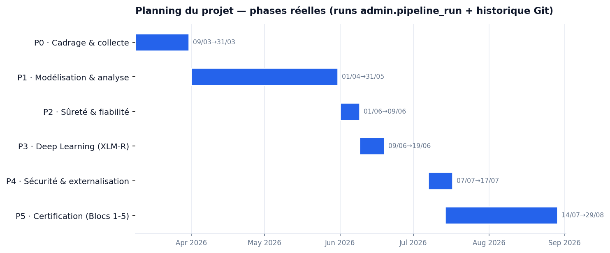

# BLOC 3 — Annexes

**Titre RNCP 39586 · Bloc 3 — Élaborer et piloter un projet data**
**Candidat :** HAOUARI Salem · **Date :** 29/07/2026 · Annexes au dossier écrit (hors décompte de pages)

> Ces annexes détaillent les livrables de pilotage référencés dans le dossier. Le planning et le suivi s'appuient sur des **traces réelles** : les runs journalisés dans `admin.pipeline_run` (mars-mai) et l'historique Git (branche `main`, dépôt public, à partir de juin).

---

## Annexe A — Planning détaillé (phases réelles)

Le projet a **débuté le 9 mars 2026**. Le planning est **authentique** — aucune date inventée : les premières phases sont datées par les runs réels journalisés dans `admin.pipeline_run`, les suivantes par l'historique Git (le dépôt ayant été formalisé en juin). Le « creux » entre le 19/06 et le 07/07 correspond à une interruption réelle (période d'examens).

| Phase | Période | Contenu | Jalons réels |
|---|---|---|---|
| **P0 — Cadrage & collecte** | 09/03 → 31/03 | Connexion Oracle, extraction des métadonnées, premiers cycles | runs 3 (13/03) et 4 (23/03) |
| **P1 — Modélisation & analyse** | 04 → 05 | Modèle en étoile, classification, comparaison N-1, ROI Monte-Carlo | runs 5 (22/04) et 6 (31/05) |
| **P2 — Sûreté & fiabilité** | début 06 | Fail-safe, audit trail, masquage PII ; calibration, SLA rappel, drift | commits `phase0`, `phase1` |
| **P3 — Deep Learning** | 09-19/06 | Fine-tuning XLM-R v1/v3, page de test interactif | commits `xlmr`, `page de test` |
| **P4 — Sécurité & externalisation** | 07-17/07 | API Azure, scraping, pgcrypto, rôles, refonte dashboard | commits `extract`, `security`, `console SQL` |
| **P5 — Certification** | 14/07 → 29/08 | Dossiers Blocs 1, 2, 3, 5 | commits `docs(certification)` |

**Méthodologie : Kanban.** Flux continu (*à faire → en cours → fait*, travail en cours limité), jalonné par les échéances de certification. Le suivi est matérialisé par les runs pipeline (phases amont) puis par les commits Git (chaque commit = une carte terminée).

---

## Annexe B — Matrice RACI (scénario de déploiement)

Pour l'industrialisation chez un client, la solution serait portée par une **équipe cible de 3-4 personnes**. Répartition des responsabilités (R = Réalise · A = Approuve · C = Consulté · I = Informé) :

| Activité | Chef de projet data | Data engineer | ML engineer | Analyste métier |
|---|---|---|---|---|
| Cadrage & spécifications | A | C | C | **R** |
| Collecte / ETL Oracle | I | **R** | C | I |
| Modélisation ML & scoring | A | C | **R** | C |
| Dashboard & restitution | I | C | I | **R** |
| Sécurité & conformité RGPD | A | **R** | I | C |
| Recette & validation métier | A | I | I | **R** |
| Documentation projet | C | C | C | C / **R** |

**Équilibrage** : chaque membre porte un domaine principal (R) tout en étant consulté (C) sur les interfaces — ni surcharge d'une personne, ni silos. **Accessibilité** : postes aménageables (matériel adapté, temps supplémentaire sur les tâches concernées) prévus dès la constitution de l'équipe.

---

## Annexe C — Grille de compétences et plan de formation

### Compétences actuelles vs requises (équipe cible)

| Compétence | Niveau actuel | Niveau requis | Écart |
|---|---|---|---|
| SQL / modélisation dimensionnelle | Confirmé | Confirmé | — |
| ETL / orchestration (Prefect) | Intermédiaire | Confirmé | Modéré |
| ML classique (scikit-learn) | Confirmé | Confirmé | — |
| **Deep Learning (transformers, XLM-R)** | Débutant | Confirmé | **Fort (critique)** |
| Sécurité / RGPD | Intermédiaire | Confirmé | Modéré |
| Dataviz / restitution | Intermédiaire | Confirmé | Modéré |

### Plan de développement des compétences

| Écart | Action de formation | Modalité | Priorité |
|---|---|---|---|
| Deep Learning | Formation transformers/HuggingFace + pair-programming sur XLM-R | En ligne + mentorat interne | **Haute** |
| ETL avancé | Montée en compétences Prefect (déploiements, orchestration) | Documentation + atelier | Moyenne |
| Sécurité / RGPD | Sensibilisation RGPD + revue avec un juriste | Atelier + accompagnement juridique | Moyenne |
| Dataviz | Bonnes pratiques (accessibilité, choix de représentation) | Auto-formation guidée | Basse |

**Prise en compte du handicap** : supports accessibles (contraste, sous-titrage des webinars), **temps supplémentaire** pour les évaluations, aménagement matériel du poste (écran, périphériques ergonomiques).

---

## Annexe D — Cas d'arbitrage : LinearSVC vs XLM-RoBERTa v3

**Problématique.** Le projet dispose de deux classifieurs. Faut-il promouvoir le transformer deep-learning en production à la place du modèle linéaire ?

### Comparaison chiffrée

| Critère | LinearSVC + Platt (production) | XLM-RoBERTa v3 |
|---|---|---|
| **Accuracy** | **0,907** | 0,838 |
| Macro-F1 | **0,869** (CV) / 0,892 (holdout) | 0,802 |
| Calibration (ECE) | correcte | **0,011 (excellente)** |
| Rappel réglementé (SLA-strict) | — | **Fin 0,89 · RH 0,94 · Ach 0,91** |
| Poids de déploiement | **quelques Mo** (`.joblib`) | **2,1 Go** (`model.onnx.data`) + runtime ONNX |
| Intégration pipeline batch | **oui** (scoring des 167 260 actifs) | non (démo interactive seulement) |
| Déterminisme / reproductibilité | **élevé** | moindre |

### Options et décision

- **Option A — Promouvoir XLM-R** : meilleure calibration et rappel réglementé, mais accuracy inférieure, 2,1 Go à déployer, non intégré au batch.
- **Option B — Garder LinearSVC** *(retenue)* : meilleure accuracy, quelques Mo, déterministe, déjà intégré.
- **Option C — Hybride** : cumulerait les forces mais doublerait la maintenance.

**Décision argumentée (Option B).** Sur la métrique décisive — l'accuracy — le LinearSVC **devance** le transformer (0,91 vs 0,84). Le coût de déploiement du XLM-R (2,1 Go + ONNX) est disproportionné pour un produit « base substituable » installé chez un client. Enfin, les deux modèles étant évalués contre des labels générés par LLM, **promouvoir le transformer sur un holdout non validé humainement ne serait pas justifiable**. Le XLM-R reste un axe de recherche (Bloc 5), promouvable *si* une comparaison équitable sur vérité terrain humaine le justifie. Décision tracée dans `docs/B_classification_ml` et la fiche modèle.

---

## Annexe E — Plan d'actions RSE, sécurité, éthique et confidentialité

| Sujet | Action mise en œuvre | Statut | Délai |
|---|---|---|---|
| **Confidentialité (RGPD)** | Masquage PII dans les exports + chiffrement `pgcrypto` au repos + minimisation (métadonnées seules, jamais le contenu métier) | **Réalisé** | P2, P4 |
| **Sécurité** | Accès Oracle en lecture seule ; comptes PostgreSQL à moindre privilège (`pfe_reader` / `pfe_writer`) | **Réalisé** | P4 |
| **Éthique de l'IA** | Publication de la justesse réelle (~58-75 %, pas le 89 % du holdout LLM) ; garde-fou `review_required` ; refus de promouvoir un modèle sur un holdout gonflé | **Réalisé** | P0-P3 |
| **Environnement (RSE)** | Recommandations d'archivage réduisant le stockage « chaud » (rapport chaud/archive ×9,8) ; coûts et gains sourcés (API Azure) | **Réalisé** | P1, P4 |
| **Confidentialité — suite** | Externaliser secrets et clés vers un coffre (HashiCorp / Azure Key Vault) au lieu de la ligne de commande | À faire | Court terme (industrialisation) |
| **Environnement — suite** | Quantifier l'empreinte CO₂ évitée (kWh par To archivé) pour chiffrer le bénéfice RSE | À faire | Moyen terme |

**Arbitrage de priorisation.** Face à des ressources limitées (projet solo), la **confidentialité et l'éthique** — à risque légal et de confiance immédiat — ont été traitées avant l'optimisation fine de l'empreinte carbone, bénéfice déjà acquis par la nature même du projet (l'archivage réduit intrinsèquement la consommation).
