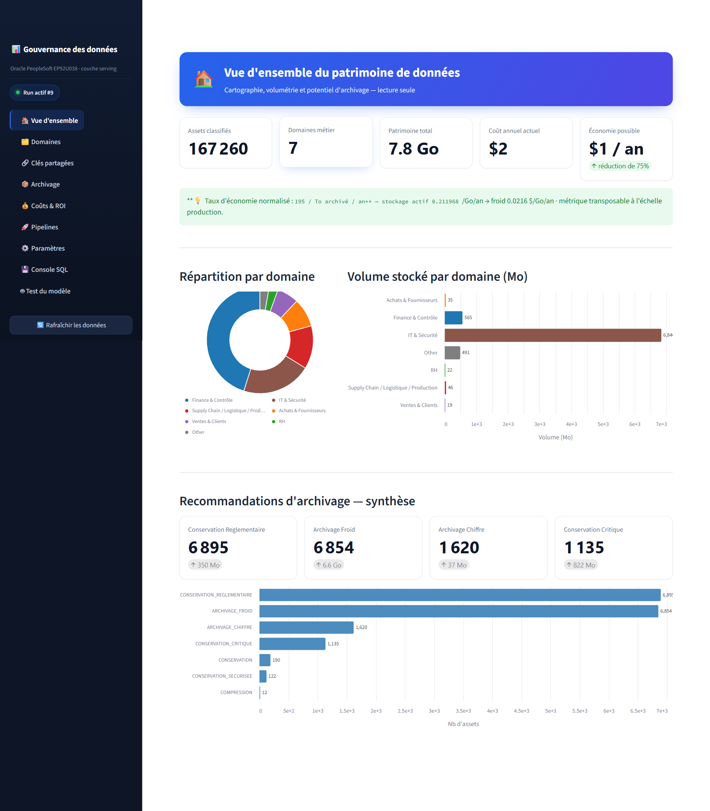
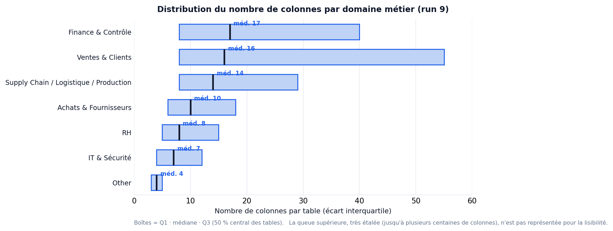
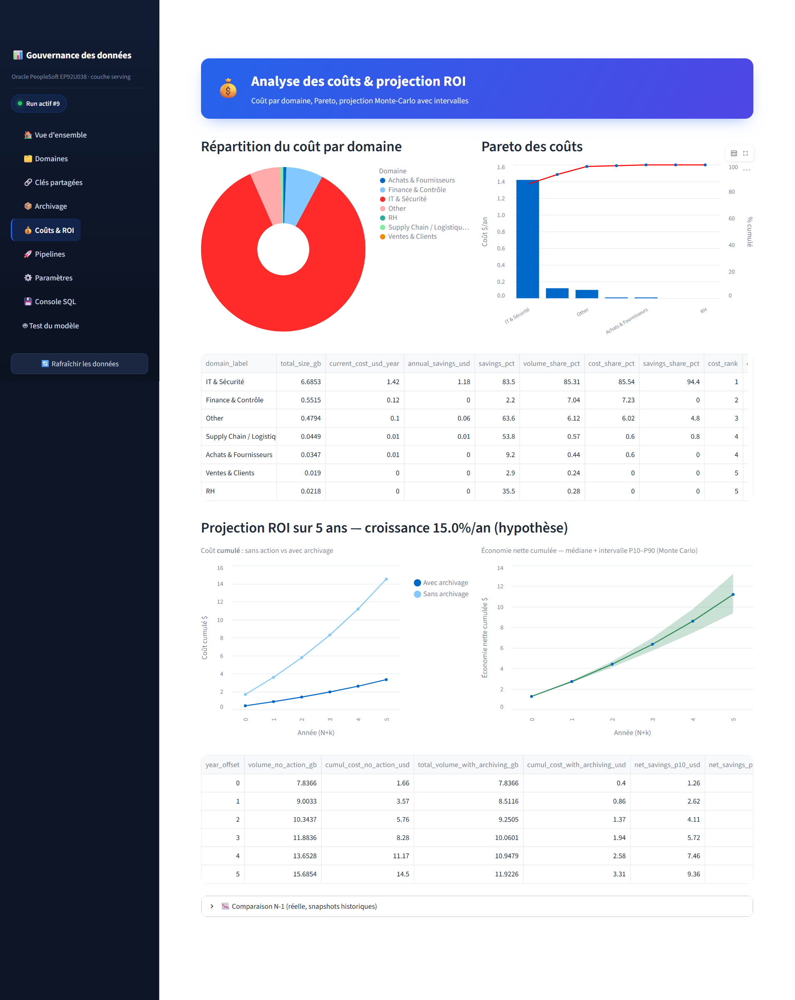
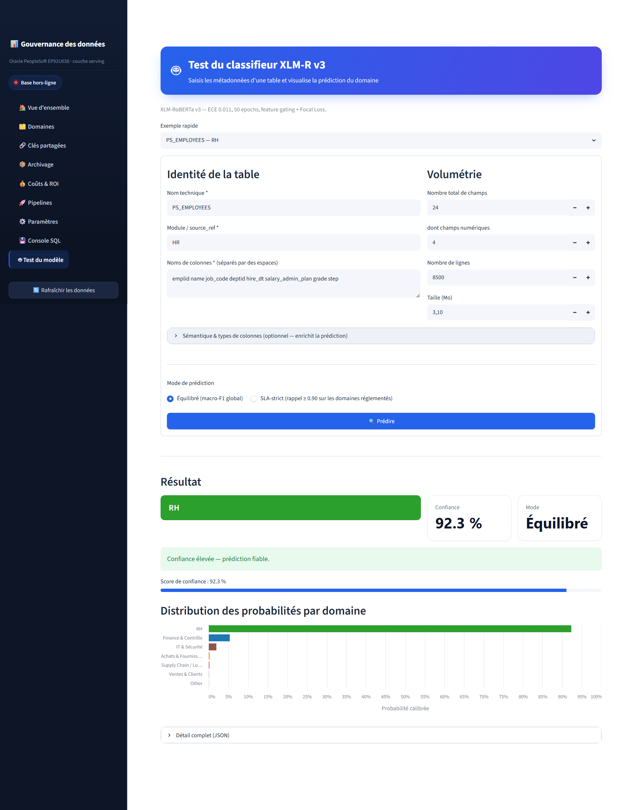

# BLOC 2 — Analyser, organiser et valoriser des données

**Titre visé :** Ingénieur en science des données spécialisé en infrastructure data ou en apprentissage automatique — **RNCP 39586** (Niveau 7)
**Candidat :** HAOUARI Salem · **Date :** 22/07/2026
**Projet :** Solution de gouvernance et d'archivage intelligent des données d'un ERP PeopleSoft (Oracle EP92U038)
**Dépôt de code :** https://github.com/Salem2025s/data-archiving-solution

> **Note de lecture pour le jury.** J'ai organisé ce dossier de sorte que chaque section corresponde à une compétence du bloc (C2.1.1 → C2.3.2) : elle présente d'abord le livrable attendu, puis se termine par un encadré « Critères couverts » qui reprend les exigences de la grille d'évaluation. Les analyses et les chiffres proviennent d'exécutions réelles sur l'entrepôt PostgreSQL `pfe_data_ia` (run 9). Les références de code renvoient au dépôt Git du projet.

---

## Sommaire

1. Contexte, commanditaire et périmètre
2. **C2.1 — Analyser les données**
   - C2.1.1 Analyse du besoin
   - C2.1.2 Plan d'analyse
   - C2.1.3 Requêtes, calculs et restitution en dashboard
   - C2.1.4 Modèles statistiques et tests d'hypothèses
3. **C2.2 — Valoriser les données**
   - C2.2.1 Représentation et visualisation des résultats
   - C2.2.2 Recommandations pour la décision
4. **C2.3 — Transmettre**
   - C2.3.1 Support de formation des utilisateurs
   - C2.3.2 Documentation technique du système d'analyse
5. Conclusion

---

## 1. Contexte, commanditaire et périmètre

### 1.1 Le commanditaire et son besoin

Le commanditaire est la **Direction des Systèmes d'Information (DSI)** d'une organisation qui exploite un ERP **Oracle PeopleSoft** (instance de référence `EP92U038`) pour ses processus transactionnels — ressources humaines, finance, paie, achats. La solution que je développe est conçue comme un **produit réutilisable** : elle vise à être déployée chez de futurs clients exploitant le même type d'ERP, la source de données n'étant qu'un paramètre à substituer. L'instance `EP92U038` sert de terrain réel de validation.

Le besoin exprimé par le commanditaire est clair : *« la base de l'ERP grossit sans qu'on sache vraiment ce qu'elle contient, ni ce qui coûte, ni ce qu'on peut archiver sans risque »*. Trois attentes en découlent :

1. **Comprendre le patrimoine** : savoir à quel objet métier se rattache chaque table, alors qu'un ERP PeopleSoft compte des dizaines de milliers de tables aux noms techniques opaques.
2. **Maîtriser les coûts** : mesurer ce que coûte le stockage, par objet métier, et estimer le gain d'une politique d'archivage.
3. **Décider sur des faits** : disposer de KPI et de projections (ROI) pour prioriser les actions d'archivage, et non décider à l'aveugle.

### 1.2 Positionnement du Bloc 2

Le Bloc 1 a établi le socle **collecte → stockage → transformation → sécurisation**. Le Bloc 2 exploite ce socle pour **analyser, organiser et valoriser** : traduire la question métier du commanditaire en analyses chiffrées, tester statistiquement des hypothèses sur le patrimoine, restituer les résultats dans un dashboard décisionnel, formuler des recommandations et transmettre le tout par de la formation et de la documentation.

### 1.3 Périmètre de données

L'analyse porte sur l'entrepôt PostgreSQL `pfe_data_ia`, alimenté par l'extraction Oracle. Au terme du run 9, le catalogue consolidé réunit **167 260 actifs de données** (records logiques PeopleSoft et tables physiques Oracle), classés en **7 domaines métier** et enrichis de scores d'archivabilité, de coûts et de ROI. C'est ce périmètre, réel et versionné, qui sert de base à toutes les analyses ci-après.

---

## 2. C2.1 — Analyser les données

### C2.1.1 — Analyse du besoin

**Livrable : une analyse du besoin.**

J'ai cadré le travail d'analyse à partir des attentes du commanditaire, en distinguant enjeux, contexte, environnement et contraintes.

#### Enjeux et problématique

L'enjeu est **économique et réglementaire** : le stockage de données historiques inactives sur du stockage « chaud » coûte cher, ralentit les sauvegardes et complexifie la conformité (RGPD, durées légales de rétention). La problématique se formule ainsi : *comment cartographier automatiquement un patrimoine de données ERP, en mesurer le coût par objet métier, et recommander une stratégie d'archivage justifiée et auditable, sans jamais mettre en péril l'intégrité du SI ?*

#### Contexte

L'organisation exploite un ERP PeopleSoft dont la base a fortement grossi au fil des années. Les tables portent des noms techniques (`PS_JRNL_HEADER`, `PS_JOB`…) que seuls quelques experts savent rattacher à un objet métier. Aucune cartographie à jour n'existe. La décision d'archivage, aujourd'hui, se prend au cas par cas, sans vision d'ensemble ni chiffrage.

#### Environnement

- **Source** : Oracle PeopleSoft `EP92U038` (dictionnaire de données applicatif + tables physiques), accessible en lecture seule.
- **Cible d'analyse** : entrepôt PostgreSQL `pfe_data_ia` en architecture médaillon (`raw → processed → serving`).
- **Outils d'analyse** : Python (pandas, scipy, scikit-learn), SQL, un dashboard Streamlit, des exports tableur (Excel).
- **Utilisateurs finaux** : analystes de gouvernance, responsables métier, DSI.

#### Contraintes

| Type | Contrainte |
|---|---|
| **Technique** | Source accessible uniquement par VPN (IP privée) ; aucune écriture sur l'ERP ; noms de tables opaques ; volume élevé (>160 k actifs). |
| **Réglementaire** | RGPD : les métadonnées et logs peuvent contenir des données personnelles ; durées légales de rétention à respecter. |
| **Coût** | Solution au stade prototype : pas de budget cloud propriétaire, outils open-source imposés (PostgreSQL, Python). |
| **Délai / logistique** | Livrable de certification à échéance fixe ; analyses devant être **rejouables** à l'identique (traçabilité par `run_id`). |
| **Produit** | La solution doit rester **générique** (base substituable) pour être vendable à d'autres clients PeopleSoft. |

> **Critères couverts (C2.1.1).** L'analyse du besoin identifie **les enjeux et la problématique** (cartographier, chiffrer et recommander l'archivage), **le contexte** (ERP PeopleSoft en croissance, sans cartographie), **l'environnement** (source Oracle, entrepôt PostgreSQL, outils, utilisateurs) et **les contraintes** (technique, réglementaire RGPD, coût, délai/logistique, produit). Elle cadre le travail d'analyse à produire dans les sections suivantes.

---

### C2.1.2 — Plan d'analyse

**Livrable : une présentation d'un plan d'analyse.**

Le plan d'analyse traduit la problématique métier du commanditaire en un **problème numérique** structuré autour de trois axes, chacun décliné en métriques mesurables sur les données disponibles.

#### Traduction de la problématique en problème numérique

| Question métier | Traduction numérique | Données mobilisées |
|---|---|---|
| « À quel métier appartient cette table ? » | Problème de **classification supervisée** multiclasse (7 domaines) | Noms, colonnes, types, features sémantiques (`dataset_asset_ml`) |
| « Combien coûte mon patrimoine, par métier ? » | **Agrégation** de coûts pondérés par la volumétrie | `size_mb`, `dim_cost_params`, domaine prédit |
| « Que puis-je archiver et pour quel gain ? » | **Scoring** d'archivabilité + projection de **ROI** | Scores `archival_candidate_score`, `roi_score`, comparaison N-1 |

**Exemple de traduction, bout en bout.** La question métier *« quels métiers dois-je documenter en priorité ? »* n'est pas directement calculable. Je la traduis en trois étapes numériques : (1) **classer** chaque table dans un des 7 domaines (problème de classification) ; (2) pour chaque domaine, **mesurer** la part de tables sans description (agrégation d'un indicateur binaire `description IS NULL`) ; (3) **tester** si cette part dépend réellement du domaine ou relève du hasard (test du χ², cf. C2.1.4). La réponse métier — *« oui, la documentation est inégale, ciblez les domaines les moins couverts »* — découle alors d'un calcul reproductible, pas d'une impression.

#### Les trois axes d'analyse et leurs métriques

**Axe 1 — Cartographie du patrimoine par domaine métier.**
Métriques : nombre d'actifs par domaine, part relative, distribution de la **confiance** de classification (bandes high/medium/low), taux d'actifs à réviser manuellement (`review_required`).

**Axe 2 — Analyse des coûts et du potentiel d'archivage.**
Métriques : volume stocké (Mo) par domaine, coût annuel actuel (stockage « chaud »), coût après archivage, économie potentielle (€/an), répartition des coûts par domaine (identifier les plus coûteux/optimisables).

**Axe 3 — Valorisation prospective (ROI et comparaison N-1).**
Métriques : score de ROI par actif, projection pluriannuelle du ROI (modèle Monte-Carlo), comparaison des indicateurs entre deux runs (analyse N-1) pour mesurer l'évolution.

#### Données disponibles et pertinentes

Toutes les métriques ci-dessus s'appuient sur des tables **déjà produites et versionnées** dans la couche `serving` : `mv_asset_inventory`, `mv_archivability_ranking`, `mv_roi_summary`, `asset_business_domain_prediction`, `dim_cost_params`. Aucune donnée à collecter en plus : le plan est directement exécutable.

> **Critères couverts (C2.1.2).** Le plan d'analyse décrit **les axes** (cartographie par domaine, coûts/archivage, ROI/N-1) et **les métriques** associées (répartition, confiance, coûts par domaine, score de ROI…). Il **traduit la problématique client en problème numérique** (classification, agrégation, scoring/projection) en identifiant précisément **les données à exploiter** — disponibles et pertinentes dans la couche `serving`.

---

### C2.1.3 — Requêtes, calculs et restitution en dashboard

**Livrable : une présentation des requêtes et des résultats sous forme de dashboard.**

Pour produire les analyses du plan, j'ai mobilisé **quatre techniques complémentaires**, chacune adaptée à un usage.

#### Technique 1 — Requêtes SQL (calculs au plus près des données)

Les agrégats lourds sont calculés en SQL, dans PostgreSQL, via des vues matérialisées. Exemple — répartition et volume par domaine :

```sql
SELECT p.business_domain_predicted AS domaine,
       COUNT(*)                     AS nb_actifs,
       ROUND(SUM(inv.size_mb)::numeric, 1) AS volume_mo
FROM serving.asset_business_domain_prediction p
JOIN serving.mv_asset_inventory inv
  ON inv.asset_id = p.asset_id AND inv.run_id = p.run_id
WHERE p.run_id = 9
GROUP BY p.business_domain_predicted
ORDER BY nb_actifs DESC;
```

#### Technique 2 — Scripts Python (analyse statistique et ML)

Le scoring de classification (`src/transform/score_business_domain.py`) et les tests statistiques (`scripts/bloc2_hypothesis_tests.py`, cf. C2.1.4) sont écrits en Python (pandas, scipy, scikit-learn) — pour tout ce que le SQL ne fait pas efficacement (calcul de p-values, modèles).

#### Technique 3 — Dashboard interactif (Streamlit)

L'application `app/streamlit_dashboard.py` restitue les résultats sans terminal : **Vue d'ensemble** (KPIs), **Domaines**, **Archivage**, **Coûts & ROI**, plus une **Console SQL** intégrée permettant à un analyste d'exécuter ses propres requêtes en lecture seule.

#### Technique 4 — Export tableur (Excel)

L'export `domain_model_run9.xlsx` (13 feuilles : profil par domaine, top candidats à l'archivage, paramètres de coût, comparaison N-1, projection ROI…) permet aux utilisateurs qui travaillent sous Excel de reprendre les analyses.

#### Résultats obtenus (run 9)

L'analyse produit rapidement des résultats justes et exploitables :

| Indicateur | Valeur (run 9) |
|---|---|
| Actifs classés | **167 260** |
| Domaines métier | 7 |
| Domaine dominant | **Finance & Contrôle — 45,1 %** (75 495 actifs) |
| 2ᵉ domaine | IT & Sécurité — 21,1 % |
| Confiance *medium* / *low* / *high* | 54,2 % / 25,6 % / 20,2 % |
| Actifs signalés à réviser | **27,1 %** (45 269) |
| Coût stockage « chaud » | 0,2120 $/Go/an (Azure Hot LRS) |
| Coût archive | 0,0216 $/Go/an (Azure Archive LRS) |

Ces résultats répondent directement aux trois questions du commanditaire : *que contient le patrimoine* (cartographie), *combien il coûte* (volumétrie × tarifs réels), *que faire* (candidats à l'archivage priorisés).



> **Critères couverts (C2.1.3).** **Plusieurs techniques d'analyse sont présentées** — requêtes SQL, scripts Python, dashboard Streamlit et export tableur Excel. Elles **permettent d'obtenir rapidement des résultats justes** au regard de la problématique : cartographie des 167 260 actifs par domaine, volumétrie et coûts, candidats à l'archivage — restitués dans un **dashboard** décisionnel.

---

### C2.1.4 — Modèles statistiques et tests d'hypothèses

**Livrable : une méthodologie de tests statistiques.**

Au-delà des agrégats descriptifs, j'ai voulu **valider statistiquement** des relations entre variables du patrimoine, plutôt que de les affirmer. J'ai donc formulé quatre hypothèses, choisi pour chacune le test adapté, et interprété les résultats. Tout est reproductible via `scripts/bloc2_hypothesis_tests.py` (seuil α = 0,05, données réelles du run 9).

#### Méthodologie et choix des tests

Pour chaque hypothèse, la démarche est identique : (1) formuler H0 (hypothèse nulle) et H1 ; (2) vérifier les conditions d'application et choisir un test **non paramétrique** quand la distribution n'est pas normale (ce qui est le cas des volumétries et scores, très asymétriques) ; (3) calculer la statistique, la p-value **et une taille d'effet** ; (4) décider et interpréter.

> **Un point de méthode assumé.** L'échantillon est très grand (n = 167 260). À cette taille, **la moindre différence devient « statistiquement significative »** (p très faible) sans être forcément *importante*. C'est pourquoi je reporte systématiquement une **taille d'effet** (epsilon², rho, V de Cramér, rang-bisérial) : c'est elle, et non la seule p-value, qui dit si le résultat compte en pratique.

#### Les quatre tests et leurs résultats

**H1 — La complexité structurelle (nombre de colonnes) diffère-t-elle selon le domaine métier ?**
- H0 : les distributions du nombre de colonnes sont identiques entre domaines. H1 : au moins un domaine diffère.
- Test : **Kruskal-Wallis** (non paramétrique, 7 domaines, n = 60 284).
- Résultat : H = 12 783,3 · **epsilon² = 0,212 (effet fort)** · p < 0,001 → **on rejette H0**.
- Médianes de colonnes : Finance 17 · Ventes 16 · Supply Chain 14 · Achats 10 · RH 8 · IT 7 · Other 4.
- Interprétation : les tables Finance sont structurellement bien plus riches que celles d'IT ou « Other ». Cela **oriente la modélisation métier** (les objets Finance méritent des vues plus détaillées) et la priorisation de la documentation.

Le graphique ci-dessous rend visible ce que le test compare : l'écart interquartile du nombre de colonnes se décale nettement d'un domaine à l'autre (médiane de 17 pour Finance contre 4 pour « Other »), ce qui explique le fort effet mesuré (ε² = 0,21).



**H2 — La taille d'une table est-elle corrélée à son nombre de colonnes ?**
- H0 : pas de corrélation monotone (rho = 0). H1 : rho ≠ 0.
- Test : **corrélation de Spearman** (n = 15 854), choisie car les tailles suivent une loi très asymétrique.
- Résultat : **rho = 0,368 (modérée)** · p < 0,001 → **on rejette H0**.
- Interprétation : il existe un lien réel mais **imparfait** — on ne peut pas déduire la taille d'une table de son seul nombre de colonnes. Le nombre de lignes et le type de contenu pèsent aussi. Conséquence pratique : le scoring d'archivabilité doit combiner plusieurs signaux, pas seulement la largeur des tables.

**H3 — L'absence de description dépend-elle du domaine métier ?**
- H0 : la présence d'une description est indépendante du domaine. H1 : elle en dépend.
- Test : **χ² d'indépendance** (ddl = 6, n = 167 260).
- Résultat : χ² = 3 681,5 · **V de Cramér = 0,148 (effet faible)** · p < 0,001 → **on rejette H0**.
- Interprétation : la documentation des tables est **inégale selon les domaines** (association réelle mais faible). C'est un enjeu de gouvernance directement actionnable : cibler la complétion des métadonnées sur les domaines les moins documentés.

**H4 — La confiance des règles mots-clés diffère-t-elle de celle du modèle ML ?**
- H0 : les deux méthodes produisent des confiances de même distribution. H1 : elles diffèrent.
- Test : **Mann-Whitney U** (keyword n = 44 568, ML n = 122 692).
- Résultat : **effet rang-bisérial = −0,674 (fort)** · p < 0,001 → **on rejette H0**.
- Médianes : keyword 0,833 · ML 0,680.
- Interprétation : les deux passes de classification **ne sont pas interchangeables** — les règles mots-clés, quand elles s'appliquent, sont plus « sûres » que le modèle ML. Cela justifie l'architecture en deux passes (règles d'abord, ML en repli) et un seuil de revue distinct par méthode.

#### Limite assumée

Une cinquième hypothèse — *« le score d'archivabilité diffère selon le domaine »* — a été **écartée après examen des données** : en périmètre Oracle-only, ce score est quasi-constant (90 % des actifs à la valeur de base 45,0), faute de signal de purge/accès dans la source. Un test l'aurait déclaré « significatif » à cause du grand n, alors que les médianes sont identiques : ce serait trompeur. Je le documente comme une **limite du périmètre**, pas comme un résultat.

> **Critères couverts (C2.1.4).** La méthodologie comporte, pour chaque test, **la formulation d'une hypothèse** (H0/H1), **le test statistique associé** (Kruskal-Wallis, Spearman, χ², Mann-Whitney — choisis selon la nature des variables) et **l'interprétation des résultats** (avec taille d'effet). Les résultats **permettent de valider ou réfuter** l'hypothèse initiale : les quatre hypothèses retenues rejettent H0 à p < 0,001, et une cinquième est honnêtement écartée après analyse.

---

## 3. C2.2 — Valoriser les données

### C2.2.1 — Représentation et visualisation des résultats

**Livrable : la visualisation des résultats de l'analyse.**

J'ai restitué les analyses dans le dashboard Streamlit, en choisissant chaque représentation selon la nature de la donnée et le public visé (analystes et décideurs, non-techniciens).

#### Choix des représentations et bénéfices attendus

| Donnée à communiquer | Représentation choisie | Bénéfice |
|---|---|---|
| Répartition des actifs par domaine (part d'un tout) | **Anneau (donut)** avec légende | Lecture immédiate des poids relatifs ; le trou central évite la surcharge du camembert plein |
| Volume stocké par domaine (comparaison de grandeurs) | **Barres horizontales triées** | Comparaison précise ; labels lisibles même pour les noms de domaines longs |
| Recommandations d'archivage (nombre par stratégie) | **Barres horizontales** + cartes-chiffres | Hiérarchise visuellement les volumes concernés |
| Projection de ROI dans le temps | **Courbes** (avec/sans archivage) | Montre l'écart cumulé année après année |
| Distribution des probabilités par classe (test du modèle) | **Barres verticales** (Altair) | Rend visible l'incertitude du modèle, pas seulement le label gagnant |

Le choix d'outils est justifié : **Altair** (grammaire graphique déclarative) pour des graphiques nets et cohérents, **Streamlit** pour une restitution interactive sans installation côté utilisateur (accès navigateur), **Excel** pour les utilisateurs qui veulent manipuler les chiffres eux-mêmes.

Deux exemples illustrent ces choix. Pour l'analyse des coûts, un **diagramme de Pareto** met en évidence que quelques domaines concentrent l'essentiel du coût — une représentation bien plus parlante qu'un simple tableau pour orienter l'effort d'optimisation :



Pour la classification, la page de test du modèle affiche non seulement le domaine prédit mais la **distribution des probabilités sur les 7 classes** : le décideur voit l'incertitude, pas seulement le verdict — ici une table RH prédite à 92,3 % de confiance :



#### Clarté de la mise en forme

Les graphiques portent des **titres explicites**, des **légendes**, des **échelles** annotées et un formatage des grands nombres (séparateurs de milliers). Les barres sont **triées** par valeur pour faciliter la lecture, et les libellés de domaine sont affichés en entier (correction d'un défaut initial de troncature).

#### Prise en compte de l'accessibilité (situations de handicap)

J'ai intégré des principes d'accessibilité visuelle, notamment pour les **déficiences de la vision des couleurs** (daltonisme, ~8 % des hommes) :

- **La couleur n'est jamais le seul vecteur d'information** : chaque catégorie est aussi identifiée par un **libellé** et par sa **position** (barres triées, légende ordonnée). Un utilisateur qui ne distingue pas deux teintes lit quand même la donnée.
- **Échelles séquentielles monochromes** (dégradés d'une seule teinte) pour les intensités, plutôt qu'un dégradé rouge-vert, piège classique pour les daltoniens.
- **Contraste texte/fond élevé** (texte sombre `#0F172A` sur fond clair) conforme aux recommandations WCAG pour la lisibilité.
- **Formes et longueurs** portent l'information dans les graphiques à barres — encodage robuste indépendant de la couleur.

> **Critères couverts (C2.2.1).** **Le choix des outils et des représentations est justifié** avec les bénéfices attendus (lisibilité, comparaison, interactivité sans installation). **La mise en forme** (titres, légendes, échelles, tri, formatage) **communique les données avec clarté et justesse** au public ciblé. **Les spécificités des personnes en situation de handicap sont prises en compte** : la couleur n'est jamais seule porteuse de sens (libellés + position), échelles monochromes, contrastes élevés.

---

### C2.2.2 — Recommandations pour la décision

**Livrable : une présentation de recommandations.**

À partir des analyses, je formule des recommandations **structurées, synthétiques et argumentées**, destinées à éclairer la décision du commanditaire.

#### Recommandation 1 — Prioriser la gouvernance sur Finance & Contrôle

Finance & Contrôle concentre **45,1 % du patrimoine** (75 495 actifs) et les tables structurellement les plus complexes (médiane de 17 colonnes, cf. H1). **Argument** : c'est le domaine à plus fort effet de levier — un effort de cartographie et de documentation y produit le plus grand retour. **Action** : y concentrer en priorité la validation humaine des classifications et la complétion des descriptions.

#### Recommandation 2 — Traiter le taux de revue de 27 % comme un chantier qualité

**27,1 % des actifs** (45 269) sont signalés `review_required`, et un quart des classifications sont en confiance *low*. **Argument** : ce n'est pas un défaut du modèle mais une **mesure honnête de l'incertitude** — les ignorer exposerait à des décisions d'archivage erronées. **Action** : organiser une boucle de validation humaine sur les cas *low*, en commençant par les domaines à enjeu (Finance).

#### Recommandation 3 — Cibler la documentation sur les domaines sous-documentés

Le test H3 établit que l'absence de description **dépend du domaine**. **Argument** : plutôt qu'un effort uniforme, cibler les domaines les moins documentés maximise le gain de gouvernance à effort constant. **Action** : produire la liste des domaines par taux de description manquante (déjà calculable) et l'adresser aux référents métier.

#### Recommandation 4 — Sécuriser le modèle de coût avant d'industrialiser le ROI

Les tarifs proviennent désormais de sources externes réelles (API Azure : 0,2120 vs 0,0216 $/Go/an, écart ×9,8). **Argument** : le ROI n'a de valeur que si ses hypothèses de coût sont sourcées et rejouables. **Action** : rafraîchir périodiquement `dim_cost_params` depuis l'API, et n'industrialiser la projection ROI qu'après quelques runs (historique de croissance observé plutôt qu'hypothèse).

#### Priorisation : gain attendu vs effort

Pour aider le décideur à arbitrer, je récapitule les recommandations par **effet de levier** (gain attendu rapporté à l'effort estimé) :

| Reco | Gain attendu | Effort estimé | Priorité |
|---|---|---|---|
| 1 — Gouverner Finance en priorité | **Élevé** — couvre 45 % du patrimoine, tables les plus complexes | Moyen — validation humaine ciblée | **1 (à lancer)** |
| 2 — Résorber les cas à réviser | **Élevé** — supprime le risque d'archivage erroné sur 27 % des actifs | Élevé — boucle de validation continue | 2 |
| 3 — Documenter les domaines faibles | Moyen — améliore la qualité de classification future | Faible — liste déjà calculable | **2 (quick win)** |
| 4 — Sourcer le modèle de coût | Moyen — fiabilise le ROI | Faible — rafraîchissement API automatisable | 3 |

Les recommandations 1 et 3 offrent le meilleur rapport gain/effort : l'une à fort impact, l'autre à effort quasi nul (*quick win*). Ce sont elles que je proposerais de lancer en premier.

#### Synthèse pour le décideur

> Le patrimoine est **concentré** (Finance = près de la moitié) et **inégalement documenté**. Le gain de gouvernance le plus rapide vient de l'effort ciblé sur Finance et sur les cas incertains, pas d'un traitement uniforme. Le potentiel d'archivage est réel (écart de coût chaud/archive ×9,8), mais sa valorisation en ROI doit attendre un modèle de coût sourcé et un historique de plusieurs runs.

> **Critères couverts (C2.2.2).** La présentation des recommandations est **structurée** (une recommandation = un constat chiffré + un argument + une action), **synthétique** (encadré de synthèse pour le décideur) et **argumentée** (chaque recommandation s'appuie sur une analyse ou un test). Elles **éclairent le commanditaire** en priorisant les actions par effet de levier plutôt que de façon uniforme.

---

## 4. C2.3 — Transmettre

### C2.3.1 — Support de formation des utilisateurs

**Livrable : un support de formation.**

#### Enjeu et sujet de la formation

L'outil d'analyse n'a de valeur que si les utilisateurs métier savent le lire et s'en servir de façon autonome. L'enjeu de la formation est donc la **montée en compétences des analystes de gouvernance et des référents métier** sur l'exploitation du dashboard et l'interprétation correcte des indicateurs — en particulier la **confiance** et le **taux de revue**, souvent mal compris (« pourquoi le modèle n'est pas sûr à 100 % ? »).

#### Analyse du besoin de montée en compétences

Le public visé n'est pas technique. Il a besoin de : (1) savoir naviguer dans le dashboard ; (2) comprendre ce que signifie chaque KPI ; (3) savoir quand faire confiance à une classification et quand la réviser ; (4) exporter et réutiliser les données.

#### Contenu du support

Le support de formation (`docs/certification/BLOC2_support_formation.md`, décliné en présentation) est structuré en modules courts :

1. **À quoi sert l'outil** — la question métier (cartographier, chiffrer, archiver).
2. **Visite guidée du dashboard** — les 4 pages clés, capture à l'appui.
3. **Lire un KPI sans se tromper** — répartition, confiance (high/medium/low), taux de revue.
4. **Le réflexe qualité** — un actif en confiance *low* ou `review_required` se **vérifie** avant toute décision.
5. **Exporter et réutiliser** — Console SQL en lecture seule et export Excel.
6. **Bonnes pratiques** — toujours filtrer par `run_id`, ne jamais décider d'archiver sur une classification non revue.

Le format retenu — **support visuel pas-à-pas avec captures** — est adapté à un public non technique : il montre l'outil réel plutôt que de le décrire abstraitement.

> **Critères couverts (C2.3.1).** **L'enjeu et le sujet** de la formation sont présentés (rendre les analystes autonomes sur le dashboard et l'interprétation des indicateurs, après **analyse du besoin de montée en compétences** d'un public non technique). **Le support est adapté au sujet** (visite guidée illustrée, modules courts, réflexe qualité) et **permet de monter en compétences le public visé**.

---

### C2.3.2 — Documentation technique du système d'analyse

**Livrable : une documentation technique.**

Le système d'analyse est documenté de façon à assurer sa **compréhension, sa transmission et sa reproductibilité**. La documentation s'adresse à deux publics : les **analystes** (usage) et les **futurs développeurs** reprenant la solution (maintenance).

#### Description des sources de données

- **Origine** : Oracle PeopleSoft `EP92U038` (dictionnaire de données + tables physiques), source unique.
- **Périmètre** : métadonnées (records, tables, colonnes, index, volumétrie), pas le contenu métier. 167 260 actifs au run 9.
- **Chaîne** : `raw_oracle` (copie brute) → `processed` (modèle en étoile) → `serving` (vues et scores analytiques). Documentée dans `docs/A_connexion_preparation/` et le dossier Bloc 1.

#### Description des méthodes de calcul

Chaque indicateur est adossé à une méthode documentée et à un module :

| Domaine | Méthode | Documentation |
|---|---|---|
| Classification par domaine | Règles mots-clés + modèle ML (2 passes), confiance graduée 0,70–0,90 | `docs/B_classification_ml/` |
| Modélisation par objet métier | Schéma en étoile, graphe de dépendances | `docs/C_modelisation_domaine/` |
| Règles d'archivage | Scores data-driven (volumétrie, âge, lignage) | `docs/D_regles_archivage/` |
| Gains de stockage | Coûts sourcés API Azure × volumétrie | `docs/E1_gains_stockage/` |
| Comparaison N-1 | Diff d'indicateurs entre runs versionnés | `docs/E2_comparaison_n1/` |
| Projection ROI | Simulation Monte-Carlo (croissance 15 %±5 %) | `docs/E3_projection_roi/` |
| Répartition des coûts | Agrégation coûts par domaine | `docs/E4_repartition_couts/` |
| Tests statistiques | 4 tests d'hypothèses (scipy) | `scripts/bloc2_hypothesis_tests.py` |

#### Description technique et fonctionnelle des indicateurs

Pour chaque KPI, la documentation précise : sa **définition fonctionnelle** (ce qu'il mesure), sa **formule technique** (colonnes et calcul), sa **source** (table `serving`) et son **run**. Exemple — l'*économie annuelle potentielle* : fonctionnellement « ce que l'organisation économiserait en archivant les candidats identifiés » ; techniquement `SUM(size_mb candidats) × (coût_chaud − coût_archive)` sur `mv_archivability_ranking` et `dim_cost_params`.

#### Reproductibilité

Chaque analyse porte un `run_id` : toute requête le filtre, toute exécution produit un instantané complet et rejouable. Les scripts (`score_business_domain.py`, `bloc2_hypothesis_tests.py`, exports) sont versionnés dans Git avec leurs commandes d'exécution. Un tiers peut ainsi **rejouer l'intégralité de l'analyse** et retrouver les mêmes chiffres.

> **Critères couverts (C2.3.2).** La documentation technique comporte **la description des sources** (origine Oracle EP92U038, périmètre métadonnées), **la description des méthodes de calcul** (classification, scoring, coûts, tests — chacune référencée à un module) et **la description technique et fonctionnelle des indicateurs** (définition, formule, source, run). Le versionnement par `run_id` et les scripts Git **assurent la compréhension, la transmission et la reproductibilité** de l'analyse.

---

## 5. Conclusion

Ce bloc met le socle du Bloc 1 au service de la **décision** :

- **Analyser** : la question du commanditaire est traduite en un plan d'analyse à trois axes, exécuté par SQL, Python et dashboard, et **validé statistiquement** par quatre tests d'hypothèses réels (avec tailles d'effet) — dont une hypothèse honnêtement écartée après examen des données.
- **Valoriser** : les résultats sont restitués dans des visualisations claires et **accessibles**, et débouchent sur des recommandations structurées et argumentées, priorisées par effet de levier.
- **Transmettre** : un support de formation rend les utilisateurs autonomes, et une documentation technique garantit la reproductibilité et la reprise de la solution.

L'ensemble reste **générique et rejouable** : conçu comme un produit substituable d'un client PeopleSoft à l'autre, il alimente naturellement le Bloc 3 (pilotage du projet data) et le Bloc 5 (modélisation ML approfondie).

---

## Annexes (hors décompte de pages)

- **A. Analyse du besoin** : synthèse enjeux / contexte / contraintes.
- **B. Plan d'analyse** : axes, métriques et données mobilisées.
- **C. Requêtes et dashboard** : captures des pages Vue d'ensemble, Domaines, Coûts & ROI ; requêtes SQL commentées.
- **D. Tests statistiques** : rapport complet des 4 tests (`bloc2_tests_resultats.md`).
- **E. Visualisations** : graphiques annotés et note d'accessibilité.
- **F. Recommandations** : fiche de synthèse pour le décideur.
- **G. Support de formation** : présentation pas-à-pas.
- **H. Documentation technique** : dictionnaire des indicateurs (définition, formule, source).
